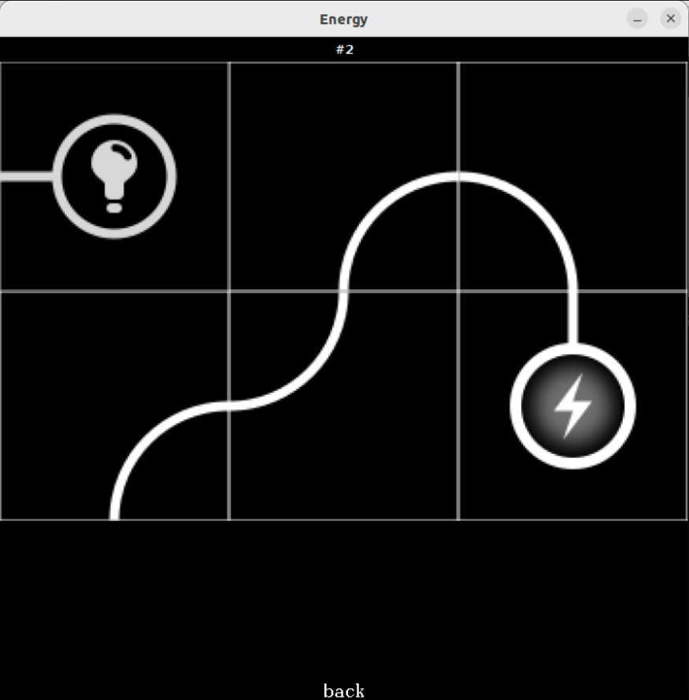
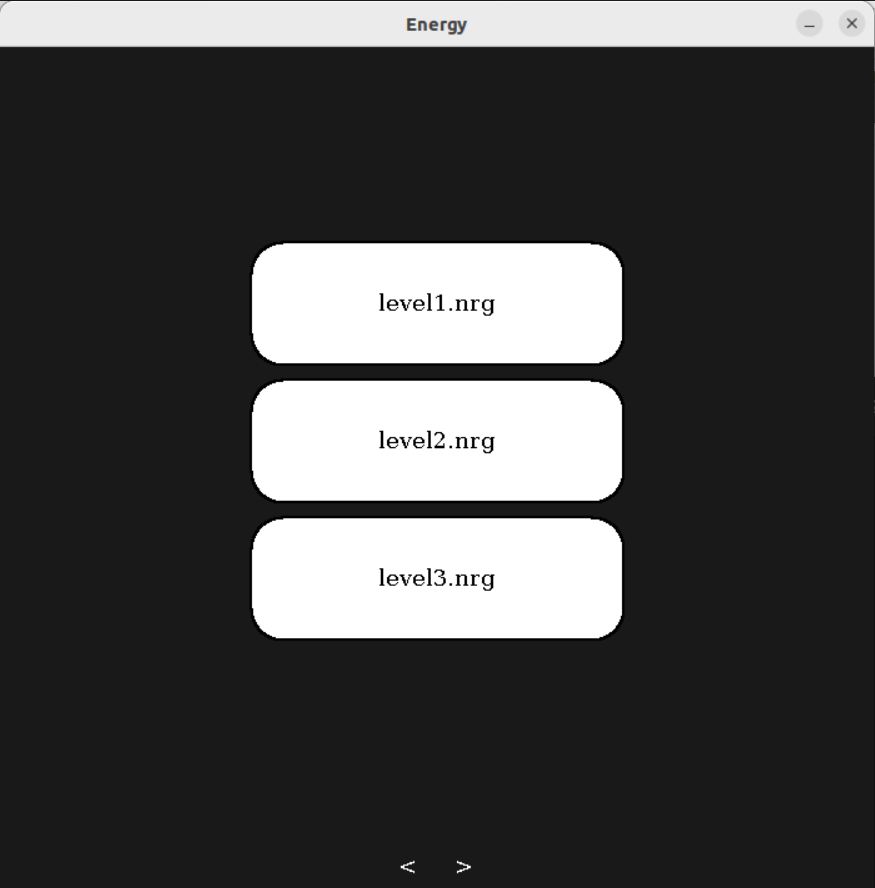
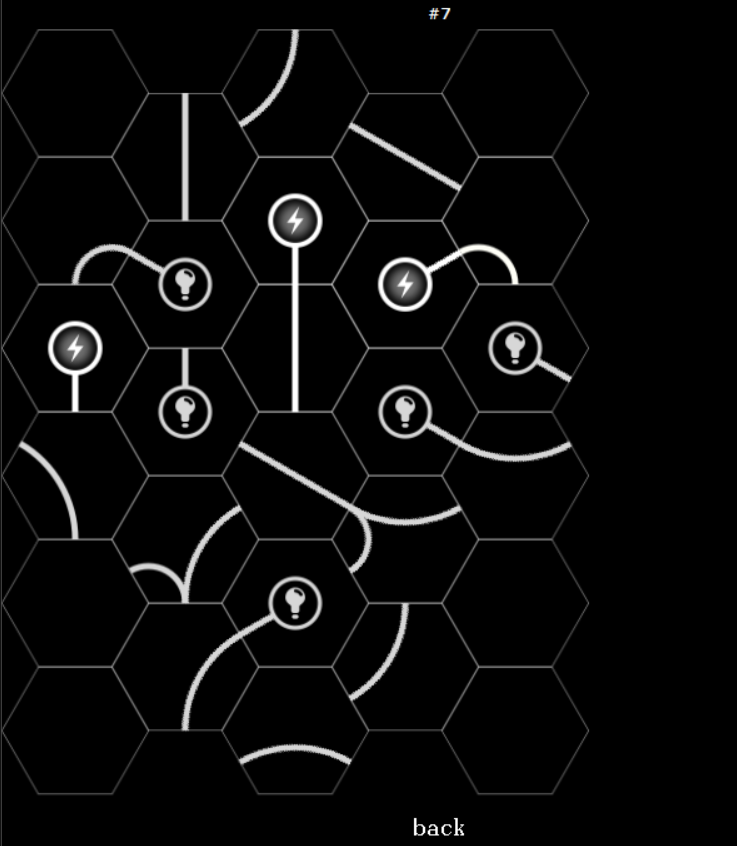
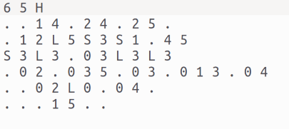

# Energy game

## Exécution et lancement du jeu

>se placer dans le dossier src

>javac energy/App.java

>java energy.App

## Fonctionnement

Le jeu Energy se joue sur un damier de taille quelconque, dont les cases peuvent être soit carrées, soit hexagonales. Sur ces cases sont posées des tuiles représentant les éléments d’un circuit électrique.

À chaque tuile est associé un sous-ensemble quelconque de l’ensemble de ses bords, appelé l’ensemble des bords connectés de cette tuile. Chaque tuile peut également contenir un unique composant, parmi trois
sortes de composants possibles : source d’énergie, lampe, ou borne wifi.

Au début du jeu, le plateau est présenté au joueur avec toutes ses tuiles, chaque
tuile ayant subi une rotation aléatoire. L’objectif du joueur est de tourner les
tuiles de manière à alimenter en énergie chaque lampe du circuit. Les règles de
diffusion de l’énergie sont les suivantes :
• Partage. Si l’un des bords connecté d’une tuile reçoit de l’énergie, tous les
autres bords connectés de cette tuile en reçoivent aussi.
• Propagation. Si un bord connecté d’une tuile est face à un bord connecté
d’une autre tuile et si le premier bord reçoit de l’énergie, le second en
reçoit aussi.
• Émission. Une source émet de l’énergie vers chacun des bords connectés
de sa tuile.
• Réception. Une lampe reçoit de l’énergie si les bords connectés de sa tuile
reçoivent de l’énergie.
• Transmission Une borne reçoit de l’énergie si l’un des bords connectés de
sa tuile reçoit de l’énergie, ou si une autre borne quelconque du plateau
reçoit de l’énergie

Exemple de plateau

## Fichiers de niveaux

Un fichier de niveau est un fichier texte dont le nom est de la forme levelnum.nrg
où num est le numéro du niveau. Un tel fichier doit décrire une configuration
gagnante du jeu. Il est structuré de la manière suivante :
• Le fichier commence par deux entiers h w, suivi de la chaîne "S" (square)
si les cases du niveau sont carrées, ou de "H" (hexagon) si elles sont hexag-
onales. Dans le premier cas, le plateau contiendra exactement h × w cases.
Dans le second, le plateau contiendra w colonnes, les colonnes de rang pair
(en commençant par 0) contiendront h lignes, et celles de rang impair h−1
lignes, leurs cases étant décalées vers le bas.
• Le fichier contient ensuite une suite d’entrées décrivant, dans la configu-
ratioin finale du jeu, le contenu des tuiles posées sur chacune des cases.
Une entrée commence par l’un des chaînes suivantes :
– "." si la tuile ne contient aucun composant,
– "S" si elle contient une source,
– "L" si elle contient une lampe,
– "W" si elle contient une borne.
Cette chaîne est ensuite suivie d’une suite strictement croissante de numéros
de bords (e.g. une suite vide, ou encore "3 4") indiquant les bords con-
nectés de la tuile. Les bords seront numérotés à partir de 0 en partant du
bord nord, et en tournant dans le sens indirect (le sens des aiguilles d’une
montre).

Le choix d’un niveau dans l’écran d’accueil sera suivi de la lecture du fichier
de niveau associé, afin de reconstruire en mémoire une configuration finale du
niveau, avant de la mélanger par rotation puis de la soumettre au joueur.

Choix de niveau

Plateau et son fichier de niveau correspondant

